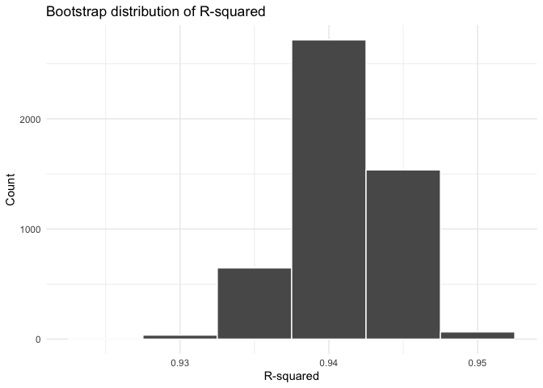
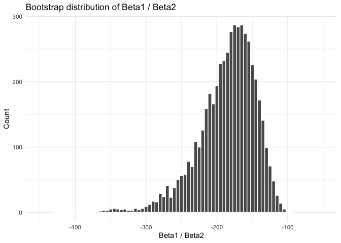

p8105_hw6_ym3139
================
Yutong Mao (UNI: ym3139)
2025-12-03

# Problem 0

In this problem, I created a public GitHub repository and associated R
Project for Homework 6. Within the project directory, I created a single
R Markdown file named `p8105_hw6_ym3139.Rmd` that renders to
`github_document`, and a `data/` subdirectory that stores all local data
files.

All my solutions for Problems 1,2 and 3 are contained in this R Markdown
file. I used git for version control, and my commit history reflects the
process of developing these solutions.

# Problem 1

``` r
# Read raw homicide data
homicide_df_raw = 
  read_csv("data/homicide-data.csv")

# Clean data and create variables
homicide_df = 
  homicide_df_raw |> 
  mutate(
    # City + state label
    city_state = str_c(city, ", ", state),
    # Binary outcome: 1 = closed by arrest, 0 = otherwise
    resolved = as.numeric(disposition == "Closed by arrest"),
    # Convert age to numeric; "Unknown" will become NA
    victim_age = as.numeric(victim_age),
    # Set reference levels for race and sex
    victim_race = fct_relevel(victim_race, "White"),
    victim_sex  = fct_relevel(victim_sex, "Female")
  ) |> 
  # Drop cities with missing race information and the Tulsa, AL error
  filter(
    !city_state %in% c("Dallas, TX", "Phoenix, AZ", "Kansas City, MO"),
    !(city == "Tulsa" & state == "AL")
  ) |> 
  # Keep only Black and White victims
  filter(victim_race %in% c("White", "Black")) |> 
  # Remove observations with missing key variables
  drop_na(victim_age, victim_race, victim_sex)

# Quick check of number of observations per city
homicide_df |> 
  count(city_state)
```

    ## # A tibble: 47 × 2
    ##    city_state          n
    ##    <chr>           <int>
    ##  1 Albuquerque, NM   174
    ##  2 Atlanta, GA       940
    ##  3 Baltimore, MD    2753
    ##  4 Baton Rouge, LA   409
    ##  5 Birmingham, AL    763
    ##  6 Boston, MA        492
    ##  7 Buffalo, NY       472
    ##  8 Charlotte, NC     571
    ##  9 Chicago, IL      4502
    ## 10 Cincinnati, OH    678
    ## # ℹ 37 more rows

``` r
# Subset data to Baltimore, MD
baltimore_df = 
  homicide_df |> 
  filter(city_state == "Baltimore, MD")

# Fit logistic regression model
baltimore_glm = 
  baltimore_df |> 
  glm(
    resolved ~ victim_age + victim_sex + victim_race,
    data = _,
    family = binomial()
  )

# Extract odds ratio and 95% CI for male vs female victims
baltimore_or = 
  baltimore_glm |> 
  broom::tidy(conf.int = TRUE, exponentiate = TRUE) |> 
  filter(term == "victim_sexMale") |> 
  select(term, estimate, conf.low, conf.high)

baltimore_or
```

    ## # A tibble: 1 × 4
    ##   term           estimate conf.low conf.high
    ##   <chr>             <dbl>    <dbl>     <dbl>
    ## 1 victim_sexMale    0.426    0.324     0.558

``` r
library(purrr)

# Fit city-specific logistic models and extract ORs and CIs
city_or_results = 
  homicide_df |> 
  group_by(city_state) |> 
  nest() |> 
  mutate(
    # Fit logistic regression within each city
    glm_fit = map(
      data,
      \(df) glm(
        resolved ~ victim_age + victim_sex + victim_race,
        data = df,
        family = binomial()
      )
    ),
    # Tidy regression output and compute ORs and CIs
    tidy_fit = map(
      glm_fit,
      \(mod) broom::tidy(mod, conf.int = TRUE, exponentiate = TRUE)
    )
  ) |> 
  select(city_state, tidy_fit) |> 
  unnest(tidy_fit) |> 
  # Keep the coefficient comparing male vs female victims
  filter(term == "victim_sexMale") |> 
  select(
    city_state,
    or_est = estimate,
    or_low = conf.low,
    or_high = conf.high
  )

# Preview results
city_or_results |> head()
```

    ## # A tibble: 6 × 4
    ## # Groups:   city_state [6]
    ##   city_state      or_est or_low or_high
    ##   <chr>            <dbl>  <dbl>   <dbl>
    ## 1 Albuquerque, NM  1.77   0.825   3.76 
    ## 2 Atlanta, GA      1.00   0.680   1.46 
    ## 3 Baltimore, MD    0.426  0.324   0.558
    ## 4 Baton Rouge, LA  0.381  0.204   0.684
    ## 5 Birmingham, AL   0.870  0.571   1.31 
    ## 6 Boston, MA       0.674  0.353   1.28

``` r
# Order cities by estimated odds ratio
city_or_results_plot = 
  city_or_results |> 
  mutate(
    city_state = fct_reorder(city_state, or_est)
  )

# Plot ORs and 95% CIs by city
ggplot(city_or_results_plot, aes(x = city_state, y = or_est)) + 
  geom_point() +
  geom_errorbar(aes(ymin = or_low, ymax = or_high), width = 0) +
  geom_hline(yintercept = 1, linetype = "dashed") +
  coord_flip() +
  labs(
    x = "City",
    y = "Adjusted OR (Male vs Female)",
    title = "Adjusted odds ratios for case resolution\ncomparing male to female victims by city"
  ) +
  theme_minimal()
```

<!-- -->

Overall, most cities show adjusted odds ratios below 1, indicating that
homicides involving male victims are less likely to be solved than those
involving female victims after adjusting for age and race. Several
cities display confidence intervals entirely below 1, suggesting a
statistically significant disadvantage for male victims. A few cities
have point estimates above 1, but all of their confidence intervals
include 1, so there is no strong evidence that male-victim cases are
more likely to be solved in those locations. The results highlight
substantial variability across cities but suggest a general pattern of
lower clearance rates for male victims.

# Problem 2

``` r
library(p8105.datasets)
data("weather_df")

# Quick check of data
weather_df |> head()
```

    ## # A tibble: 6 × 6
    ##   name           id          date        prcp  tmax  tmin
    ##   <chr>          <chr>       <date>     <dbl> <dbl> <dbl>
    ## 1 CentralPark_NY USW00094728 2021-01-01   157   4.4   0.6
    ## 2 CentralPark_NY USW00094728 2021-01-02    13  10.6   2.2
    ## 3 CentralPark_NY USW00094728 2021-01-03    56   3.3   1.1
    ## 4 CentralPark_NY USW00094728 2021-01-04     5   6.1   1.7
    ## 5 CentralPark_NY USW00094728 2021-01-05     0   5.6   2.2
    ## 6 CentralPark_NY USW00094728 2021-01-06     0   5     1.1

``` r
# Function: run one bootstrap sample and compute statistics
boot_once = function(df) {

  # Sample rows with replacement
  df_boot = df |> 
    sample_frac(size = 1, replace = TRUE)

  # Fit linear model
  fit = lm(tmax ~ tmin + prcp, data = df_boot)

  # Extract R^2
  r2 = broom::glance(fit)$r.squared

  # Extract coefficients
  coef_tbl = broom::tidy(fit)
  
  # Find beta1 (tmin) and beta2 (prcp)
  beta1 = coef_tbl |> filter(term == "tmin") |> pull(estimate)
  beta2 = coef_tbl |> filter(term == "prcp") |> pull(estimate)

  # Ratio beta1 / beta2
  ratio = beta1 / beta2

  # Return as a named list
  tibble(
    r2 = r2,
    ratio = ratio
  )
}
```

``` r
library(purrr)

set.seed(2025)

# Run 5000 bootstrap samples
boot_results = 
  rerun(5000, boot_once(weather_df)) |> 
  bind_rows()

# Preview results
boot_results |> head()
```

    ## # A tibble: 6 × 2
    ##      r2 ratio
    ##   <dbl> <dbl>
    ## 1 0.939 -196.
    ## 2 0.939 -139.
    ## 3 0.938 -227.
    ## 4 0.942 -177.
    ## 5 0.941 -188.
    ## 6 0.938 -190.

``` r
# R^2 distribution
p_r2 =
  ggplot(boot_results, aes(x = r2)) +
  geom_histogram(binwidth = 0.005, color = "white") +
  labs(
    title = "Bootstrap distribution of R-squared",
    x = "R-squared",
    y = "Count"
  ) +
  theme_minimal()

# Ratio distribution: all ratios are negative, between about -430 and -95
p_ratio =
  ggplot(boot_results, aes(x = ratio)) +
  geom_histogram(binwidth = 5, color = "white") +
  coord_cartesian(xlim = c(-450, -50)) +
  labs(
    title = "Bootstrap distribution of Beta1 / Beta2",
    x = "Beta1 / Beta2",
    y = "Count"
  ) +
  theme_minimal()

p_r2
```

<!-- -->

``` r
p_ratio
```

<!-- -->

``` r
summary(boot_results$ratio)
```

    ##    Min. 1st Qu.  Median    Mean 3rd Qu.    Max. 
    ## -428.50 -207.65 -179.41 -185.58 -157.13  -95.74

``` r
# 95% CI for R^2
ci_r2 =
  boot_results |> 
  summarize(
    low  = quantile(r2, 0.025),
    high = quantile(r2, 0.975)
  )

# 95% CI for ratio
ci_ratio =
  boot_results |> 
  summarize(
    low  = quantile(ratio, 0.025),
    high = quantile(ratio, 0.975)
  )

ci_r2
```

    ## # A tibble: 1 × 2
    ##     low  high
    ##   <dbl> <dbl>
    ## 1 0.934 0.947

``` r
ci_ratio
```

    ## # A tibble: 1 × 2
    ##     low  high
    ##   <dbl> <dbl>
    ## 1 -281. -125.

The bootstrap distribution of R-squared is very concentrated, and the
95% bootstrap confidence interval is approximately \[0.93, 0.95\]. This
indicates that the linear model with `tmin` and `prcp` as predictors
consistently explains a large proportion of the variability in `tmax`,
and that the goodness-of-fit is quite stable across resamples.

In contrast, the bootstrap distribution of the ratio β̂₁ / β̂₂ is much
more dispersed and lies entirely on the negative side, with a 95%
confidence interval roughly between -280 and -125. This suggests that
the coefficients for `tmin` and `prcp` tend to have opposite signs, and
there is substantial uncertainty in the magnitude of their ratio. The
bootstrap results therefore show high precision for R-squared but
considerably greater uncertainty for the coefficient ratio.
